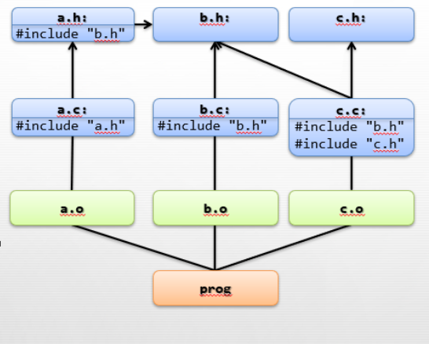

# Makefile

## Guidelines on Making Makefile

- In root directory, make a file called ```makefile```  (it doesn’t have any extension)
- To find dependencies of the c files, run  ```gcc -MM *.c```
- Use the printed information to make a makefile

## Example

 |
|:--:|
| *Example* |

### Finding dependencies
- $```gcc -MM *.c```

```
a.o: a.c a.h b.h
b.o: b.c b.h
c.o: c.c c.h b.h
```


### makefile

```
prog: a.o b.o c.o
    gcc a.o b.o c.o -o prog
   
a.o: a.c a.h b.h
    gcc -c b.c

b.o: b.c b.h
    gcc -c b.c

c.o: c.c c.h b.h
    gcc -c c.c
```

## Running makefile

- $ ```make```


- $ ```make clean``` (cleans outputs)