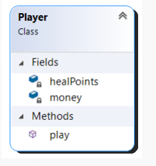
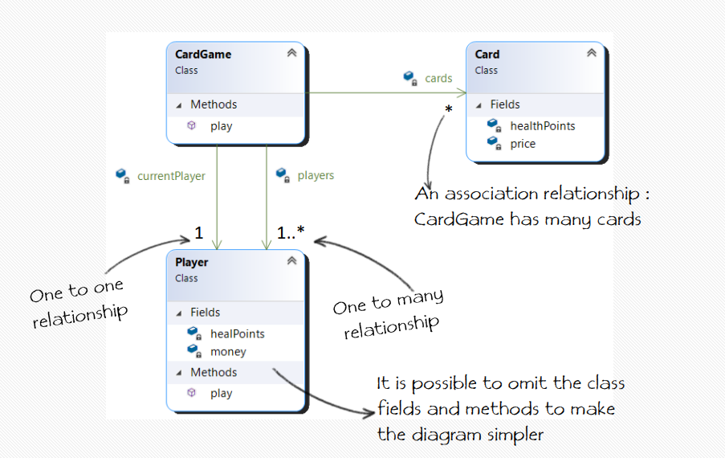

# 📋 UML
> Unified Modeling Language

UML is a modeling language providing a standard way for
visualizing the design of a system
- Easier to design, develop, explain, discuss and maintain
  large projects using images instead of code
- Although it contains a large number of diagrams and roles,
  we will focus only on a small part:
1. Class Diagrams
2. Sequence Diagrams

## Class Diagram
- Describes the static structure of a system
- Shows the classes, their attributes and methods, and the relationships among them

 |
|:--:|
| *Class* |

 |
|:--:|
| *Class Diagram* |

- 1 : One to one relationship
- 1..* : One to many
- \* : Association relationship (one to many) 

