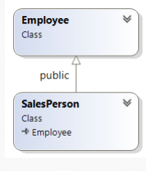
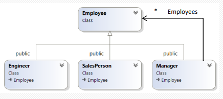

# C++
# 👨‍👩‍👧 Inheritance

```cpp
class Employee {

  public:
    // ...
    string getName() const;
    void giveRaise(int amount);

  private:
    string name;
    Date birth;
    int salary;

}; 
```
Inheritance allows us to take an existing class, and derive new classes from it. So Engineer inherits the functionality of Employee.


```cpp
class Engineer : public Employee {

  public:
    // engineer-only functions ...
    void addDegree(string degree);
    void addReview(string text, int score);

  private:
    set<string> degrees;
    list<string> reviews;


}; 
```

The inheriting class has all the fields and methods of the base class, plus the new ones it defines.

```cpp
void f(Engineer& engineer) {
  // Defined in Engineer
  engineer.addDegree("B.Sc. Computer Science");
  // Defined in Employee
  engineer.giveRaise(10);
}
```

## UML
There are several equivalent terms for describing
inheritance relations:
- Class *SalesPerson* inherits class *Employee*
- Class *SalesPerson* derives from class *Employee*
- *Employee* is the base class and *SalesPerson* is the derived class
- *Employee* is the superclass and *SalesPerson* is the subclass

 |
|:--:|
| *For describing inheritance in UML use an empty triangle* |

## Access Control

The derived class cannot access the private section of
the base class (even though it contains it!)

```cpp
void Engineer::addReview(string text, int score) {
  reviews.push_front(text);
  if (score == 5) {
    salary += 1000; // ERROR! Salary is private
  }
}
```

### Protected

- Protected members can be accessed from within any class deriving from the base class
- Protected members cannot be accessed from outside the class

```cpp
class Employee {

  // PUBLIC
  public:
    string getName() const;
    void giveRaise(int amount);

  // PRIVATE
  private:
    string name;
    Date birth;

  // PROTECTED
  protected:
    int salary;

}; 
```
```cpp
void Engineer::addReview(string text, int score) {
  reviews.push_front(text);
  if (score == 5) {
    salary += 1000; // OK
  }
}

void f(Engineer& engineer) {
  engineer.salary = 1000; // ERROR!
}

```

## Subtyping
A derived class such as Engineer is a subtype of the base class Employee (Engineer "is an" Employee )

- This means that an Engineer can be used wherever an Employee is
  acceptable
- This is possible because all the public members of the base class are guaranteed to be available in the derived class as well
- An engineer **is** an employee

- In C++, if B is a subtype of A, this means that B* can be used as A*, and B& can be used as A& (NOT vice versa)

```cpp
Engineer myEngineer("Jane Doe");
SalesPerson mySalesPerson("John Doe");
Employee myEmployee("John Smith");

Employee& employee_ref = engineer; // o.k.
Employee* employee_ptr = &salesPerson; // o.k.

Engineer* engineer_ptr = &myEmployee; // ERROR

Employee copy = myEngineer; // compiles, but probably a bug (see Note)

Employee* array[] = {
  &myEngineer, &mySalesPerson, &myEmployee
};

```
> **Note:** ```Employee copy = myEngineer;``` will copy ONLY the Employee parts of myEngineer

## Constructors

When constructing a derived class, its base class part is constructed first. The order of
operations is:
1. The base class members are constructed
2. The base class constructor code is called
3. The derived class members are constructed
4. The derived class constructor code is called

```cpp
class Manager : public Employee {

  public:
    Manager(string name);
    bool isManagerOf(const Employee* emp) const;
    void addEmployee(Employee* emp);
    ~Manager();
    
  private:
    // Some employees can be managers themselves too
    set<Employee*> employees;
    
};

// The base class constructors are not inherited
Manager::Manager(string name) :
Employee(name), employees() {}

Manager::~Manager() {
  // Employee is destructed here automatically
}

```
```cpp
Manager ceo("Ron");
Manager m1("Liav");
ceo.addEmployee(&m1);
Engineer e1("John");
ceo.addEmployee(&e1);
Engineer e2("Yossi");
m1.addEmployee(&e2);
giveRaiseAndLog(ceo);
```

 |
|:--:|
| *Design pattern known as composite* |


## Overriding Methods

Using overrides, each class in the hierarchy can
have a different behavior for the same message:

```cpp

class Employee {
  public:
    // ...
    void giveRaise(int amount);
}; 

class SalesPerson : public Employee {
  public:
    // ...
    void giveRaise(int amount);
};

class Manager : public Employee {
  public:
    // ...
    void giveRaise(int amount);
}; 

void SalesPerson::giveRaise(int amount) {
  Employee::giveRaise(amount + comissionRate * sales);
}
```
```cpp
void timeForBonus(SalesPerson& salesPerson, Manager& manager, Engineer& engineer)
{
  salesPerson.giveRaise(1000);
  manager.giveRaise(1000);
  engineer.giveRaise(1000);
}
```

## Inheriting an STL Class

Creating a MultiStack which **is a** Stack.

```cpp
class MultiStack : public Stack {
public:
	explicit MultiStack(int size);
	void popK(int k);
  void print() const; 
	
	class NotEnoughElements {};
};

// CONSTRUCTOR
MultiStack::MultiStack(int size)
	: Stack(size) // Using Stack
{}

// FUNCTIONS
// New Function that I add where i can pop k elements
// (You could also override existing Stack functions)
void MultiStack::popK(int k) 
{
	if (getSize() < k) {
		throw NotEnoughElements();
	}
	for(int i = 0; i < k; ++i) {
		pop();
	}
}


```

## Array
BAD
```cpp
Engineer engineer("Jane Doe");
SalesPerson salesPerson("John Doe");
Manager manager("Mr. Bossman");

Employee employees[] = {
  engineer, salesPerson, manager
};

```
GOOD (we must store pointers)
```cpp
Employee* employees[] = {
  &engineer, &salesPerson, &manager
};

list<Employee*> employees2;
employees2.push_back(&engineer);
employees2.push_back(&salesPerson);
employees2.push_back(&manager);
```
Problem:
```cpp
for (int i = 0; i < 3; ++i) {
  employees[i]->giveRaise(100); // will always do Employee giveRaise()
  // (static binding)
}
```
Fix:
```cpp
for (int i = 0; i < n; ++i) {
  Employee *e = employees[i];
  if (e.getType()=="manager") {
    ((Manager*)e)->giveRaise(100);
  }
  // repeat for every type ...
}

```
But there is a **better solution**: Virtual Functions


## Virtual Functions
A virtual function has dynamic binding (as opposed to static binding), which means the identity of the function is determined at run-time

```cpp
class Employee {
  public:
    // ...
    virtual void giveRaise(int amount);
}; 

class SalesPerson : public Employee {
  public:
    // ...
    void giveRaise(int amount) override;
}; 

class Engineer : public Employee {
  public:
    // ...
    void giveRaise(int amount) override;
}; 

class Manager : public Employee {
  public:
    // does not override giveRaise()
}; 
```
```cpp
Engineer engineer("Jane Doe");
SalesPerson salesPerson("John Doe");
Manager manager("Mr. Bossman");

Employee* employees[] = {
  &engineer, &salesPerson, &manager
};

for (int i = 0; i < 3; ++i) {
  e->giveRaise(1000);
}

```

## Abstract Classes
In many cases, the base class represents an abstract concept. In such cases, we can declare a pure virtual function. Pure virtual functions have no implementation in the base class
```cpp
class Employee {
  public:
    // ...
    // This function is not implemented for general Employee
    virtual void giveRaise(int amount) = 0;
    // So you need to add '= 0' at the end
}; 

class SalesPerson : public Employee {
  public:
    // ...
    // Salesperson provides a concrete implemtation of giveRaise()
    void giveRaise(int amount) override;
};
```
A class with one or more pure virtual functions is called an abstract class.
> A derived class that implements all the pure-virtual functions becomes a
concrete class, and objects can be created from this class

```cpp
Employee e; // error (abstract)
SalesPerson s; // o.k.
Employee* ptr = &s;
Employee& ref = s;
```

## Interfaces
An abstract class that has only pure virtual functions is called an interface.
```cpp
class Shape {

  public:
    virtual void rotate(double angle) = 0;
    virtual void draw() const = 0;
    virtual double area() const = 0;
};

class Circle : public Shape {
  // ...
  public:
    Circle (double radius);
    void rotate(double angle) override;
    void draw() const override;
    double area() const override;
}; 

double Circle::area() const {
  return radius * radius * PI;
}
// … implementation of all virtual functions
```

- **Constructors are never virtual** – we always use the constructor of the exact class we want to create
- **Destructors must be virtual when using inheritance** - This ensures that if we delete an object through a pointer to its base class, the correct destructor is called

```cpp
class Employee {
// ...
  public:
  // =default can also be used
    virtual ~Employee() {}
    // ...
};
```
```cpp
Employee* emp = new Engineer("John");
// ...
delete emp;
```
Without the virtual only the base d'tor is called. But with the virutal, the correct d'tor will be called Engineer::~Engineer() will be called at runtime

## Polymorphism
This code will even work for future employee types that haven't been written yet
```cpp
class Employee {
  public:
    virtual void giveRaise(int amount);
    virtual double getYearlyCost() const;
    virtual ~Employee() {}
};
```
```cpp
double yearlyCost(const Employee* employees[], int n) {
  double totalCost = 0.0;
  for (int i = 0; i < n; ++i) {
    // we don't need to know the type of each employee
    // we just ask it for its cost
    totalCost += employees[i]->getYearlyCost();
  }
  return totalCost;
}
```

## Override Keyword
> Q: also when overriding interfaces do we need to write virtual?

## Constructors and Destructors

Question: What if we wanted the ability to create an
exact copy of an object, but we only had a pointer to
its base class?

```cpp
Shape* duplicateShape(const Shape* s) {
  Shape* newShape = // ??? I don't know what type of shape it is
  newShape->moveX(10);
  newShape->moveY(10);
  newShape->show();
  return newShape;
}
```
Solution: define a virtual clone() function in the base class
```cpp
class Shape {
  // ...
  public:
    virtual Shape* clone() const = 0;
    // ...
};

class Circle : public Shape {
  // ...
  public:
    Circle(double radius);
    virtual Shape* clone() const;
    // ...
}; 

Shape* Circle::clone() const {
  return new Circle(*this);
}
```

```cpp
Shape* ptr = new Circle(3.0);
Shape* copy = ptr->clone();

// From the example above:
  Shape* newShape = s->clone();
```

## Catching Errors

```cpp
class Stack {	
  // ...	
  class Exception : public std::exception {};
	class Full : public Exception {};
	class Empty : public Exception {};
};
```
```cpp
void f() {
	try {
		Stack s(100);
		do_stuff(s);
	} catch (const Stack::Full& e) {
		cerr << "Not enough room";
	} catch (const Stack::Exception& e) {
		cerr << "Error with stack";
	} catch (const std::exception& e) {
		cerr << e.what() << endl;
    // what() is a virtual function (defined in std::exception)
	}
}
```