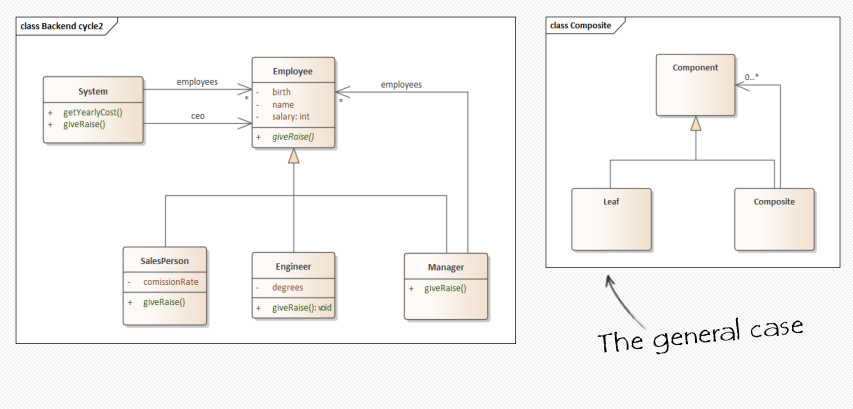

# 🖌️ Design

Projects are developed in iterations also called cycles or sprints; each contains...

All requirements (Backlog) -> Requirements

### Cycles

Requirements -> Design -> Implementation -> Testing -> Maintenance ( -> Requirements -> Design -> ... )

### Packages and Modules

- We need to design the interaction between packages
- For each such module, we build its own UML diagrams
- Then do the coding. Usually each has its own namespace.

In a lot of cases a software involves interacting with other systems, or a hardware/device. We need to describe that also.

### Sequence Diagrams
- Describe one flow scenario in a system.
- Usually, we describe the main scenarios
  using multiple sequence diagrams.
- Useful to describe a bug in the system
> See Cycle 2


## Cycle 1

 |
|:--:|
| *Cycle 1* |

### Requirements

- Handle all company employees.
- Each employee has a name, birth and basic salary.
- Two types of employees: salesperson and engineer
- Compute the company yearly cost
- Give a raise/bonus to all employees. Each has a different way of calculating the bonus:
- Engineer get’s bonus using its degrees
- Salesperson get’s bonus using its commission rate

 |
|:--:|
| *Cycle 1* |

### Design

Pseudocode
```
void System::giveRaise
{
  for each employee in employees {
    employee->giveRaise();
  }
}

float System::getYearlyCost
{
  float cost = 0;
  for each employee in employees {
    cost += employee->getSalary();
  }
  return cost;
}
```

- We finish designing, coding and testing
- We showed it to our client and then ...

## Cycle 2

### Requirements

- A new requirement: adding manager
- Each manager has its own workers
- Each manager decides whether to give a bonus to its employees

 |
|:--:|
| *Cycle 2* |

### Design

Pseudocode (Changing giveRaise())
```
void System::giveRaise
{
  CEO->giveRaise();
}
```

> Class diagram only describes the static state of the system. It is not enough.

**Sequence Diagram** describes a dynamic flow in a system.

 |
|:--:|
| *Cycle 2* |

## Design Patterns

### Design Patterns
- General reusable solutions to common problems
  in software design
- Not a finished solution
- With names to identify them
- They deal with
    - Relationships between classes or other collaborators
    - Abstractions on top of code
- Patterns are not concerned with
    - Algorithms
    - Specific implementation or classes


### Categories

- Behavioural
    - Concerned with communication between objects
    - Examples taught in class: Iterator, Strategy, Command

- Structural
    - Concerned with class and object composition
    - Examples taught in class: Composite, Adapter, Decorator
- Creational
    - Concerned with creating and accessing objects
    - Examples taught in class: Abstract Factory, Singleton

### Composite

 |
|:--:|
| *Cycle 2* |


