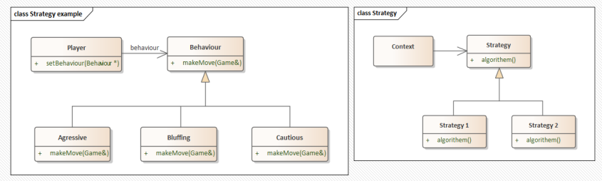
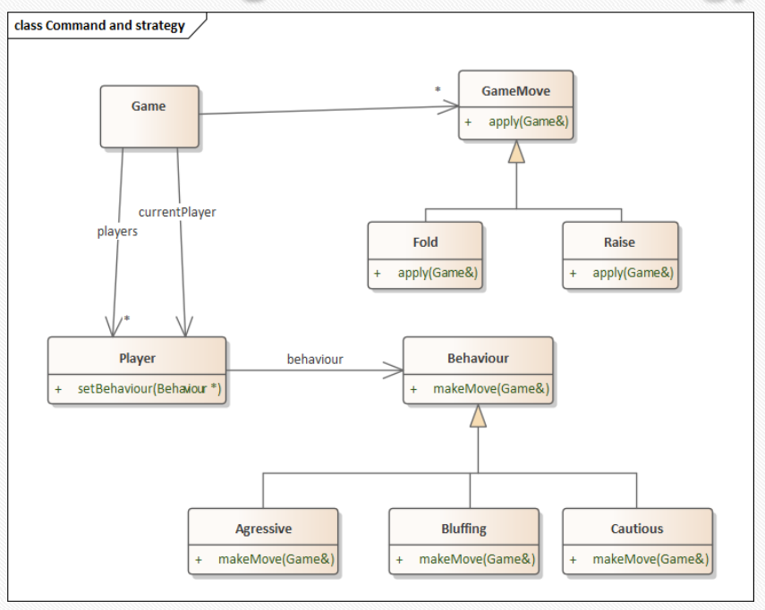
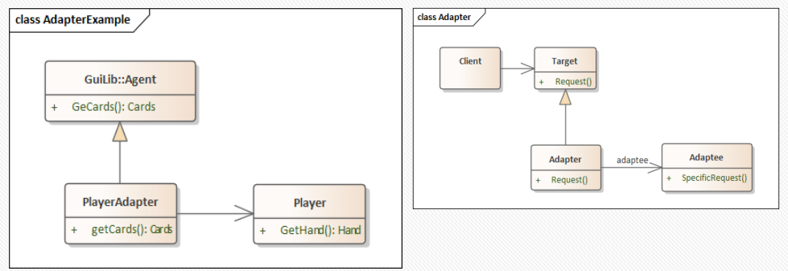
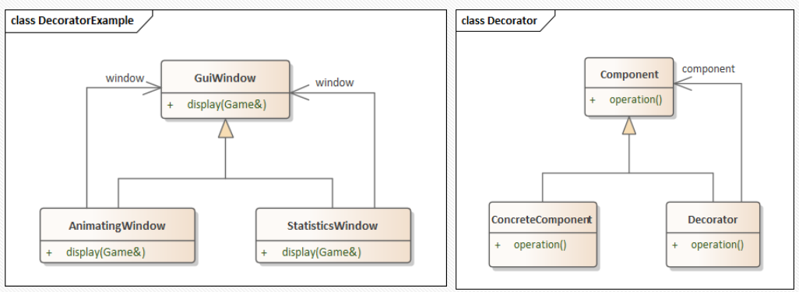
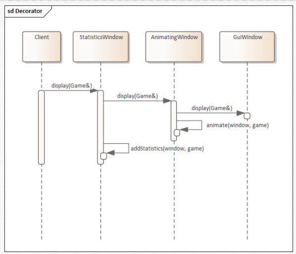
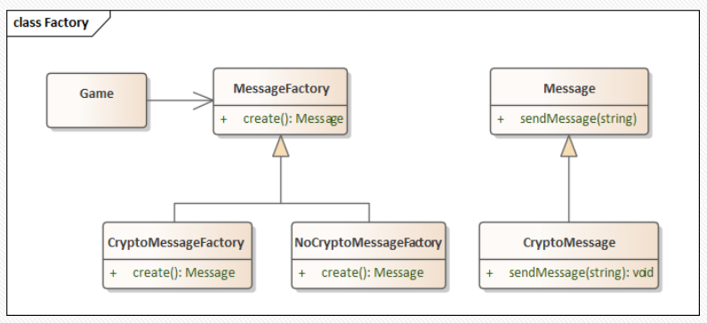
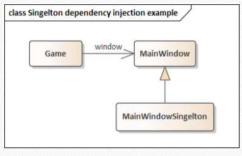

# Example - :spades: Poker Game

We're building a Poker Game application; each player makes a move on their turn.

A player can **call**, **fold**, or **raise**.

```cpp
class Game {
  Player *players;
  // For design simplicity, ignore memory for now
public:
  void fold();
  void call();
  void raise(int amount);
};
```
```cpp
class Player {
public:
  string getName();
  int getMoney();
  void makeMove(Game& game)
};
```

## Strategy - Motivation

Lets compare different strategies for:
- Add a computer player with a different behaviours:
  Cautions, Aggressive, Bluffing, etc.
- Each behaviour plays differently the makeMove.
- How should we design our Player class?

### Using Enums?
```cpp
enum class Behaviour {
  Aggressive, Cautious, Bluffing
};

class Player {
  Behaviour behaviour;
public:
    void makeMove(Game& game) {
    switch(behaviour) {
      case Behaviour::Aggressive: …
      case Behaviour::Cautious: …
      case Behaviour::Bluffing: …
    }
  }
};
```
Problems with this solution:
- Adding new behaviours is hard and tiresome
- It requires modifying the Player class
- A given behaviour can influence more then one method.
- For example, other methods than makeMove are influenced by
  behaviour.
- If we used enums, our implementation would be split up across multiple
  methods.
- We want to add a behaviour with as little change to the
  current situation.

### Using Inheritance?

```cpp
class Player {
  Behaviour behaviour;
public:
    virtual void makeMove(Game& game) = 0;
};

class AggressivePlayer : public Player {
public:
  void makeMove(Game& game) override;
};
```
Problem:
- Changing behaviour requires copying and creating a new
  object

### Solution

Instead of solving the problem inside Player, we decompose
the problem
- Extract the behaviour to an external class
- Pass it to Player

 |
|:--:|
| *Strategy* |

And so:
```cpp
class Behaviour {
  virtual void makeMove(Game& game) = 0;
};

class AggressiveStrategy : public Strategy {
public:
  void makeMove(Game game&) override;
};

class Player {
  Behaviour *m_behaviour;
public:
  void setBehaviour(Behaviour *behaviour) { m_behaviour = behaviour; }
  void makeMove(Game& game) { return m_behaviour->makeMove(game); }
};
```


## Command - Motivation


How will we design the moves: call, fold, or raise?
- We also want to keep track of all moves
- For example, to allow move undo


Problems:
- Game can already be a very large class; we don't want to make it
  bigger.
- We will want to add more game moves in the future, with a little
  change to the system.
- The logic around making a move is identical
- Log the move made
- Check if round finished
- Move control to the next player if not


### Solution

Separate GameMove and all its types into a separate class hierarchy.

 |
|:--:|
| *Class Command Example* |
```cpp
class Game {
  vector<GameMove*> moves;
  void makeMove(GameMove* move) {
    cout << "Applied: " << move;
    moves.push_back(move);
    move->apply(*this);
    nextPlayer();
  }
public:
  void undo() {
    GameMove* m = moves.pop_back();
    if (m != nullptr) {
      m->undo();
    }
  }
  void fold() {
    makeMove(new Fold());
  }
  //...
};
```
```cpp
class GameMove {
public:
  virtual void apply(Game&) const = 0;
  virtual void undo(Game&) const = 0;
};

class Fold : public GameMove {
public:
  void apply(Game& game) const override;
  void undo(Game&) const override;
};

class Call : public GameMove {
public:
  void apply(Game& game) const override;
  void undo(Game&) const override;
};

class Raise : public GameMove {
  int amount;
public:
  void apply(Game& game) const override;
  void undo(Game&) const override;
};
```

## Combining Strategy and Command

 |
|:--:|
| *Combining Strategy and Command* |

 |
|:--:|
| *Combining Strategy and Command* |

## Adapter - Moivation

- Let’s create a Graphical User Interface (GUI) for our poker
  game. Luckily, someone already wrote a complete general
  card game GUI library.
- Unfortunately, and expectedly, our types don't match
- The library defines its own classes for Card, Suit, Player, etc.
- How can we leverage the library?

Our Code:
```cpp
namespace Poker {
  class Hand;
  class Player;
  class Game;
}
```
Library Code:
```cpp
namespace GuiLibrary {
  typedef int Suite;
  typedef int Rank;
  struct Card;
  class Cards;
  class Agent;
  class CardGame;
  class GuiWindow;
}
```

What if we just replaced all our types with the library's types?
- Pros:
    - A single unified type is easier to use and reason about
- Cons:
    - A lot of work! Our types are already used all over our program
    - We give up control of our abstractions
        - Our types are probably better suited to our application than those of a generic
          library
    - What happens if we need to use another third-party library for AI
      playing card games?
        - We can't replace our types with both libraries!


### Solution

Instead of replacing one types with another, we'll create special ad-hoc adapters




```cpp
namespace Poker {
  class Player {
  public:
    virtual string getName() const = 0;
    virtual Hand getHand() const = 0;
  };
}
```
```cpp
namespace GuiLib {
  class Agent {
  public:
    virtual string getName() const = 0;
    virtual Cards getCards() const = 0;
  };
}
```
```cpp
namespace Poker {
  class PlayerAdapter : public GuiLib::Agent {
    Player* m_player;
  public:
    PlayerAdapter(Player* player) : m_player(player) { }
    string getName() const override {
      return m_player->getName();
    }
    GuiLib::Cards getCards() const override {
      return convertHandToCards(m_player->getHand());
    }
  };
}
```

## Decorator - Motivation

We want to enhance our GUI:
- Example features:
    - Profile picture for every player
    - Animations when folding/raising/calling
    - Show additional statistics near every player
        - Total cash, number of wins, etc.
- Choose some features and compose them one after
  the other
    - Each time different features can be chosen.

How do we go about implementing these features?

Why not just add these functions to our main GUI
class?
- We don't want our classes to get too big
    - We don't want to complicate it with this new demands
- Picking and toggling features is hard to maintain

### Solution

We can use basic inheritance to wrap some method calls with additional logic:
```cpp
class GuiWindow {
public:
  virtual void display(CardGame& game);
};

class AnimatingWindow : public GuiWindow {
public:
  void display(CardGame& game) override {
    GuiWindow::display(game);
    animate(game);
  }
};

class StatisticsWindow : public GuiWindow {
public:
  void display(CardGame& game) override {
    GuiWindow::display(game);
    addStatistics(game);
  }
};
```
- Again, we use a wrapper, and prefer composition
  over inheritance.
- This will work even if GuiWindow is itself
  abstract
- The downside - we have to add more manual
  delegation code.

 |
|:--:|
| *Decorator: Solution (Composition)* |

```cpp
class GuiWindow {
public:
  virtual void display(Game& game);
};

class AnimatingWindow : public GuiWindow {
  GuiWindow* window;
public:
  void display(Game& game) override {
    window->display(game);
    animate(window, game);
  }
};

class StatisticsWindow : public GuiWindow {
  GuiWindow* window;
public:
  void display(Game& game) override {
    window->display(game);
    addStatistics(window, game);
  }
};
```
```cpp
GuiWindow* animatingWindowWithStatistics =
  new StatisticsWindow(new AnimatingWindow(new GuiWindow()));

animatingWindowWithStatistics->display(game);
```
 |
|:--:|
| *Decorator: Solution (Composition)* |


## Abstract Factory - Motivation

We want to be able to take our game online
- When security is needed, we need to attach a special cryptographic token for every request
- Compute crypto token is time consuming so will not do that if it is not needed.
- We need a way to create different messages in different circumstances

### Solution

If we had virtual constructors, we could have easily solved this problem using polymorphism
- Unfortunately, constructors are never virtual…
- Factories are the next best thing!

 |
|:--:|
| *Abstract Factor: Solution* |

```cpp
class Message {
public:
  virtual void sendMessage(const string &message);
};

class CryptoMessage : public Message {
public:
  void sendMessage(const string &message) override {
    string encrypted = encrypt(message);
    Message::sendMessage(encrypted);
  }
};
```
```cpp
class Game {
  MessageFactory *m_factory;
public:
  Game(MessageFactory *factory):
  m_factory(factory) {}
  void sendMove(const GameMove& move) const {
    Message *message = m_factory->create();
    message->send(move.describe());
  }
};
```
```cpp
class Factory {
public:
  virtual Message *create() const = 0;
};

class CryptoMessageFactory : public Factory {
public:
  CryptoMessage *create() const override {
    return new CryptoMessage;
  }
};

class NoCryptoMessageFactory : public Factory {
public:
  Message *create() const override {
    return new Message;
  }
};
```
## Singleton - Motivation

We want to prevent creating multiple game windows in
our application
- Creating a window is very expensive
- Client can be confused and update the wrong
  window
- It's better to enforce this during compilation than at
  runtime by disallowing multiple instance from being
  created at the first place

### Solution 1

```cpp
class MainWindow {
  static MainWindow* instance;
  MainWindow() {} // private constructor
public:
  static MainWindow& getInstance() {
    if (instance == nullptr) {
      instance = new MainWindow(); // lazy initialization
    }
    return *instance;
  }
  static void destroy() {
    delete instance;
    instance = nullptr; // only way to clean up
  }
  MainWindow(const MainWindow& other) = delete; // there can be only one
  MainWindow& operator=(const MainWindow& other) = delete;
  
  void display(Game& game); // other methods
}
```
How to use:
```cpp
MainWindow.getInstance()->display(game);
```

### Solution 2

```cpp
class MainWindow {
  static MainWindow* instance;
  MainWindow() {} // private constructor
public:
  static MainWindow& getInstance() {
    // guranteed to be destroyed, instantiated on first use
    static MainWindow instance;
    return instance;
  }
  MainWindow(const MainWindow& other) = delete;
  MainWindow& operator=(const MainWindow& other) = delete;
  void display(Game& game);
}
```
How to use:
```cpp
MainWindow.getInstance()->display(game);
```

### Considerations

Although simple on the surface, the singleton design pattern has far-reaching consequences...

- A Singleton class cannot be subclassed
    - Nor should it be
    - Remember, if A extends B then A is a B!
- A Singleton is a global object accessible from all areas
  of the code
    - Inherit all global objects problems ➔
      Try to avoid singletons with state.
- What happens if some time in the future, you find out
  you do need two windows (for example, tabs)?

Sometimes we still need to prevent creation of
multiple objects, what then?

- Instead of calling getInstance, use
  dependency injection:
- Define an interface for your singletonto implement
- Accept the interface as a parameter in your
  functions/classes instead of directly accessing the
  global function
- Only the outer layer (e.g., the main function) knows
  that it is actually a singleton

### Singleton - Dependency Injection

```cpp
class MainWindow {
public:
  virtual void display(Game& game) = 0;
};

class MainWindowSingleton : public MainWindow {
  // ...
};

class Game {
  MainWindow* window;
public:
  Game(MainWindow* window):
    window(window) {}
    
  void start() {
    window->display(*this);
  }
};

int main() {
  Game game(MainWindowSingleton.getInstance());
  game.start();
}
```

 |
|:--:|
| *Singleton - Dependency Injection* |